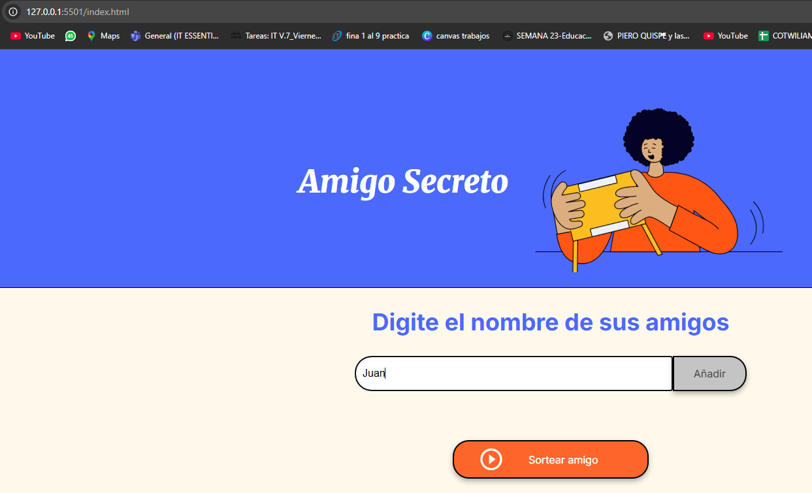
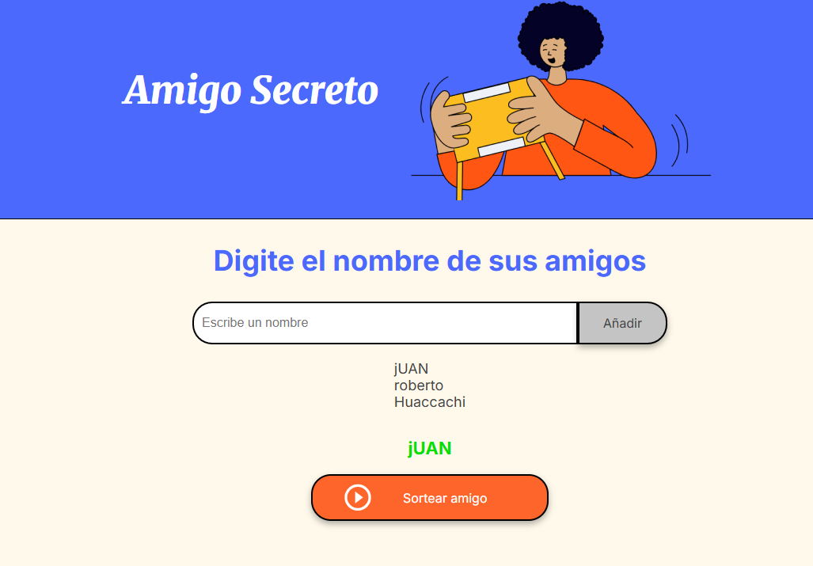

# Amigo Secreto

## 📌 Descripción
El proyecto **Amigo Secreto** es una aplicación web sencilla que permite a los usuarios ingresar nombres de amigos y realizar un sorteo aleatorio para asignar un "amigo secreto".  
El objetivo es practicar **lógica de programación**, manipulación del DOM y eventos en JavaScript, mientras se crea una herramienta divertida y útil.

---

## 🛠 Funcionalidades

1. **Agregar amigos**  
   - Los usuarios pueden ingresar nombres en un campo de texto y añadirlos a la lista.  
   - El sistema valida que el campo no esté vacío.  

2. **Mostrar lista de amigos**  
   - Cada nombre ingresado se muestra en una lista dinámica en la página.  
   - Se actualiza automáticamente cada vez que se agrega un nuevo amigo.  

3. **Sortear un amigo secreto**  
   - Selecciona aleatoriamente un nombre de la lista de amigos.  
   - Muestra el resultado en la sección de resultados.  
   - Previene sorteos si no hay nombres en la lista.  

---

## 🖥 Capturas de Pantalla

### Agregar nombres

  

### Sortear amigo secreto

  